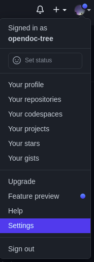

## Distributed version control system


## Git workflow


1) Modify your files in the working tree.

2) Stage the changes you want to include in the next commit.

3) Commit your changes. (Committing will take the files from the index and store them as a snapshot in the repository.)

### There are three main components of a Git project:
* **Working tree or Working directory** - it is likes a file system where you can view and modify files
* **Index or Staging area**             - where commits are prepared. When you make a change in the working tree, the index marks the file as modified before it is committed
* **Repository**                        - it is the container that tracks the changes of your project files. It holds all of the commits. commit is a snapshot of all your files at a point in time.

### What is Local Repo and Remote Repo
* **Local repo** - Local repo stays on our local machine and we do all works on local repo
* **Remote repo** - Remote repository is a repository where we can store our local repo and it stay on cloud. It also called a central repo. github, gitlab, bitbucket provide remote repo service 

## How to generate personal access tokens from your github account for push and pull

**1-st)** Click on **Setting** to go your profile setting page



**2-nd)** Click on ```Developer settings``` &#8594; Click on ```Personal access tokens``` &#8594; Click on ```Generate new token``` &#8594; Give Your github password

**3-rd)** Now you will get to see a **New personal access token** form

* **Note** - write some note, for what are you generate this token
* **Expiration** - Set your token expiration date
* **Select scopes** - Check all box

Then click on ```Generate token```

**4-th)** Now you can see your personal access token. Copy this token and keep it a secure place. Because it have to provide you at push and pull time

## Create repository | push a project | check logs | check status | clone project

### &#8594; How to create a new repository and push a project into this repositoy

**1-st)** Goto the project directory

**2-nd)** Initialize git to create a local git repo
```
git init
```
**3-rd)** Add all files of the reo to staging area
```
git add .
```
OR, add a file to staging area
```
git add filename
```
**4-th)** Record the changes of file in the version history with a message.
```
git commit -m "write your commit message"
```
**5-th)** Add your remote repository URL with a alias name permanently in git
```
git remote add <alias> <remote repository URL>
```
* **alias** - it is a alias name which we use at push and pull. actually the alias name is refers to the remote repo url

example - 
```
git remote add origin https://github.com/opendoc-tree/webdev.git 
```
**5-th)** Transfer the commits from your local repository to a remote server
```
git push <alias> <branch>
```
example - 
```
git push origin master
```

Now it will ask for username and password
* **username** - provide your github username
* **password** - provide your github personal access token


### &#8594; How to push a project after change anything
```
git add .
git commit -m "write your commit message"
git push <alias> <branch>
```
### &#8594; download content from remote repo and update the local repo with this content
```
git pull <alias> <branch>
```
### &#8594; how to show list of commit of a repository
```
git log
git log -n         // to see latest n number commits
git log --oneline  // to see a commit detilas at oneline in commit list
```
### &#8594; how to check a commit details 
```
git show <commit id>
```
### &#8594; how to copy a existing remote repository
```
git clone <remote repositoy url>
```

## Restore, Reset & Revert

### &#8594; Restore is used to undo changes of files in working directory.
```
git restore .           // undo all file changes
    OR
git restore filename  // undo a specific file changes
```
**Use Case**
```
[centos@git-lab webdev]$ cat data.txt       // this is content of data.txt file
sun
moon
earth

[centos@git-lab webdev]$ vi data.txt       // edit data.txt file
[centos@git-lab webdev]$ cat data.txt      // this is the current content of data.txt file
sun
moon

[centos@git-lab webdev]$ git restore .     // execute git restore to undo current changes
[centos@git-lab webdev]$ cat data.txt      // now data.txt file is restore by his previos content 
sun
moon
earth
```

### &#8594; Reset is used to unstaged files from staging area.
```
git reset .           // remove everything from staging area
   OR
git reset filename  // remove a perticular files from staging area
```
**Use Case**
```
[centos@git-lab webdev]$ git status                                        // this is current status that showing the modified file is not stagged
On branch master
Changes not staged for commit:
  (use "git add <file>..." to update what will be committed)
  (use "git restore <file>..." to discard changes in working directory)
	modified:   data.txt

no changes added to commit (use "git add" and/or "git commit -a")

[centos@git-lab webdev]$ git add .                                        // execute git add to staged modified file

[centos@git-lab webdev]$ git status                                       // now the status is showing the modified file is in staged area for commit 
On branch master
Changes to be committed:
  (use "git restore --staged <file>..." to unstage)
	modified:   data.txt

[centos@git-lab webdev]$ git reset .                                     // execute git reset to unstaged modified file
Unstaged changes after reset:                                            // output showing modified file is unstaged from staging area
M	data.txt

[centos@git-lab webdev]$ git status                                     // now the status is showing the modified file is not stagged
On branch master
Changes not staged for commit:
  (use "git add <file>..." to update what will be committed)
  (use "git restore <file>..." to discard changes in working directory)
	modified:   data.txt

no changes added to commit (use "git add" and/or "git commit -a")
```

### &#8594; Revert is used to undo your current changes after commit
```
git revert <last commit id>
```
**Use Case**
```
[centos@git-lab webdev]$ cat data.txt                           // this is content of data.txt file
sun
moon
earth

[centos@git-lab webdev]$ vi data.txt                            // edit data.txt file
[centos@git-lab webdev]$ cat data.txt                          // this is the current content of data.txt file
sun
moon

[centos@git-lab webdev]$ git add .                            // execute git add to staged modified file
[centos@git-lab webdev]$ git commit -m "second commit"        // execute git commit to record the current changes in the repository

[centos@git-lab webdev]$ git log -1 --oneline                 // execute git log to find out current commit
76bd7dc (HEAD -> master) second commit

[centos@git-lab webdev]$ git revert 76bd7dc                   // execute git revert with current commit id to undo current changes of file
[master 26ed287] Revert "i want ro restore my previos work"
 1 file changed, 1 insertion(+)
 
[centos@git-lab webdev]$ cat data.txt                         // now data.txt file is restore by his previos content 
sun
moon
earth

```

## Branch & Merge


A branch represents an independent line of development (it means we can work on each branch independently). We take the independent lines of development created by git branch and integrate them into a single branch using git merge

### &#8594; Show all branches.
```
git branch
```
##### * is indicate the currently active branch

### &#8594; Create a new branch.
```
git branch <branch name>
```
**Remember that when we create a new branch, everything of the repo is copied to the new branch**

**Use Case**
```
[centos@git-lab webdev]$ git branch test
[centos@git-lab webdev]$ git branch
* master
  test
```

### &#8594; how to switch to another branch.
```
git checkout <branch name>
```
**Use Case**
```
[centos@git-lab webdev]$ git checkout test
Switched to branch 'test'
[centos@git-lab webdev]$ git branch
  master
* test
```
now you can see * is in test branch. It means, now you are in test branch

### &#8594; How to merge a branch with another branch.
```
git merge <branch name>
```
* use branch name which you want to merge

**Use Case** 

Suppose You want to merge changes of the ```test``` branch in the ```master``` branch

**1-st)** go to master branch. 
```
git checkout master
```
**2-nd)** Now execute ```merge``` command

If you want to merge test branch from local
```
git merge test
```
OR, If you want to merge test branch from remote
```
git merge origin/test
```
**3-rd)** then push your changes to remote master branch
```
git push origin master
```
* **origin** - is the alias name of remote repository URL

### &#8594; How to delete a branch from local and remote both
* From local
```
git branch -d <branch name>

	  OR
	  
git branch -D <branch name>   // for force delete
```
* From remote
```
git push <alias> --delete <branch name>
```

## What is gitignore

gitignore file is a text file where each line contains a pattern for files/directories to ignore

Create ```.gitignore``` file in project root directory
```
# If want to ignore everything
*

# If want to ignore file or folder just write file or folder name
logs
.idea

# Allow those folder which don't want to ignore
!src
!build
```
we use ```.gitignore``` file when we add all files of project directory to staging area using ```git add .```
